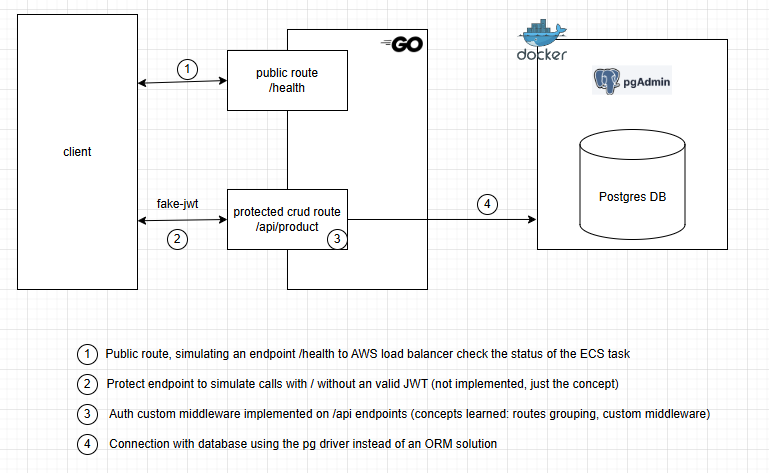

## Quick sandbox CRUD Rest API for personal learning using Go and Gin Gonic

#### This project aimed to serve as a sandbox for me to practice Go's syntax and explore its unique error-handling concept. I focused on understanding error flow and building the /products route, implementing the main HTTP verbs while deepening my knowledge of the Gin Gonic framework. Some concepts are only simulated and not fully implemented (such as JWT authentication). Another important point to highlight is that configuration values are exposed, which would not be acceptable in a real application.



## How to Run

 - Docker Engine and Docker compose is needed.
 - To start dev mode (dependencies on docker and api on dev mode) run `./scripts/start-dev`
 - The PGAdmin will start at localhost:8080, you can connect with postgres DB and run the following script to create products table.
 - To use the **protected routes** on /api path, the request headers must have the fake JWT at `Authorization: fake_token_JWT`
 - Make a GET request to http://localhost:3001/api/products

 ```curl
 GET http://localhost:3001/api/products
 POST http://localhost:3001/api/products
 GET http://localhost:3001/api/products/:productId
 DELETE http://localhost:3001/api/products/:productId

 UPDATE NOT IMPLEMENTED
 PATCH NOT IMPLEMENTED
 ```

 ## Next steps
 - Unit test